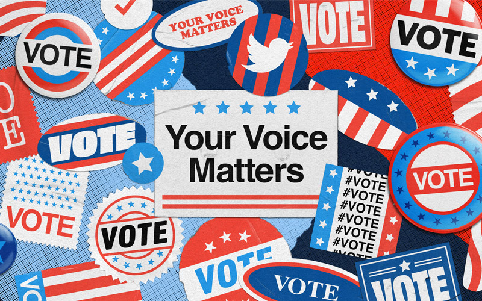

<body>

<figure>

<figcaption><small>
 source: twitter
</small></figcaption>
</figure>

</body>

## Motivation

US polls have been the center of attention in recent presidential elections due to the fact that the results have not accurately reflected predictions ([US PresidentialElection Polls Failure](https://news.northeastern.edu/2020/11/04/the-polls-were-still-way-off-in-the-2020-election-even-after-accounting-for-2016s-errors/)). 
Pollsters suggest that the evidence of the 2016 and 2020 elections will improve polling models. 

On the other hand, the evolution of social media has been tied to political behavior such as voting ([Twitter as Indicator for Political Behavior](https://journals.plos.org/plosone/article?id=10.1371/journal.pone.0079449)). Since the public is quickly losing the trust of polls for political elections, researchers are now exploring whether social media activity can be utilized to assess offline political behavior (Can Twitter Data Forecast Presidential Elections?) (https://www.tandfonline.com/doi/full/10.1080/19475683.2020.1829704). We believe that extracting online social networking environments can shed light on communication patterns and political preferences of individuals.

We hypothesize that social media (within the US and potentially outside of the US) can be beneficial in identifying elelectoral behaviors. We want to use Twitter (specifically geocoding tweets referencing presidential candidates) to identify the political affiliation to that region. 

## Data Sources

[US Election Twitter ](https://www.kaggle.com/manchunhui/us-election-2020-tweets)

[2020 Election Forecast](https://github.com/fivethirtyeight/data/tree/master/election-forecasts-2020)

[2020 Election](https://www.kaggle.com/unanimad/us-election-2020)

## Website Overview

[**Project Report**](report.html): An overview of project aims, data cleaning, visualization/analyses, and discussion.  

[**Polls Visualizations**](polls_clean.html): Various plots and graphs to visualize trends in voting trends by state. 

[**Election Results Visualisation**](election_result.html):

[**Twitter Visualization**](tweet_clean.html): 

[**Twitter Word Cloud**](wc_redirect.html): Interactive tool to explore most frequent words within tweets accordingly to user defined parameters. (_pop-up window_)

[**Polls vs. Tweets Comparison**](TBD): Comparing association between polls data and tweet data with presidential outcome by state.   

[**Screencast**](link to screencast) A brief 2 minute screencast of our project can be found.

&nbsp;

<a href="">Chankasaul, JR</a> | <a href="https://tbd2117.github.io">de Araujo, Thiago</a> | <a href="">Kao, Chia-Wen</a>| <a href="">Ostropolets, Anna</a>

 2020 

