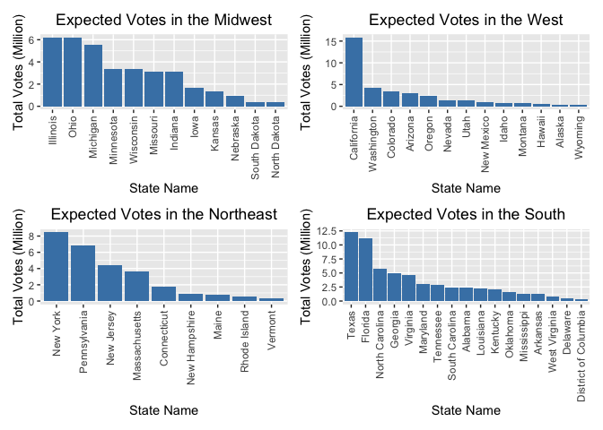
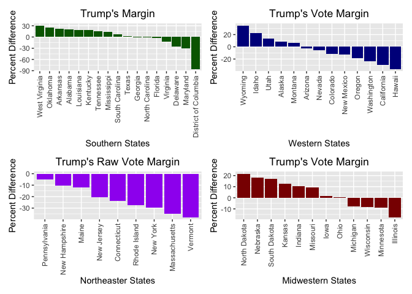

P Project Experiment
================

``` r
#Clean & Merge Polls and Region datasets 

polls_df=
  read_csv("./datasets/presidential_state_toplines_2020.csv") %>%
  rename(date = modeldate) %>% 
  mutate(date = as.Date (date, format = "%m/%d/%Y"))%>% 
  separate(date, into = c("year", "month", "day")) %>%  
   select(state, month, day, candidate_chal,
          winstate_chal, voteshare_chal,
          candidate_inc, winstate_inc, voteshare_inc, 
          margin, state_turnout,
          -candidate_chal, -candidate_inc) %>% 
  rename(
    biden_winstate = winstate_chal, 
    biden_voteshare = voteshare_chal,
    trump_winstate = winstate_inc, 
    trump_voteshare = voteshare_inc, 
    voteshare_margin = margin,
    expvote_turnout = state_turnout) %>% 
  arrange(state, month, day)
```

    ## Parsed with column specification:
    ## cols(
    ##   .default = col_double(),
    ##   branch = col_character(),
    ##   model = col_character(),
    ##   modeldate = col_character(),
    ##   candidate_inc = col_character(),
    ##   candidate_chal = col_character(),
    ##   candidate_3rd = col_logical(),
    ##   state = col_character(),
    ##   winstate_3rd = col_logical(),
    ##   voteshare_3rd = col_logical(),
    ##   voteshare_3rd_hi = col_logical(),
    ##   voteshare_3rd_lo = col_logical(),
    ##   timestamp = col_character()
    ## )

    ## See spec(...) for full column specifications.

``` r
region_df = 
    read_csv("./datasets/states.csv") %>% 
    rename(state = State)  
```

    ## Parsed with column specification:
    ## cols(
    ##   State = col_character(),
    ##   `State Code` = col_character(),
    ##   Region = col_character(),
    ##   Division = col_character()
    ## )

``` r
polls_merge =
    merge(
    polls_df,
    region_df,
    by = "state") %>% 
  arrange(state, month, day) %>% 
  select(-`State Code`) %>% 
  relocate("state", "Region") %>% 
  view ()
```

``` r
exp_votes=
  polls_merge %>% 
  select (state, Region, month, day, expvote_turnout) %>% 
  drop_na() %>% 
  group_by(Region, state, month) %>%     
  summarize(
    nov_turnout = mean(expvote_turnout),) %>% 
  filter(month == 11) %>% 
  view ()
```

    ## `summarise()` regrouping output by 'Region', 'state' (override with `.groups` argument)

``` r
expvote_plot1 = 
  exp_votes %>%
    filter(Region == "Midwest") %>% 
    ggplot(aes(x = reorder(state, desc(nov_turnout)), y = nov_turnout/1000000)) +
    geom_bar(stat = "identity", position = position_dodge(), fill='steelblue') +
      labs(
        title = "Expected Votes in the Midwest", 
        x = "State Name", 
        y = "Total Votes (Million)") +
    theme(axis.text.x = element_text(angle=90, vjust=0.5, hjust=1),
          plot.title = element_text(hjust = 0.5))

expvote_plot2 = 
  exp_votes %>%
    filter(Region == "West") %>% 
    ggplot(aes(x = reorder(state, desc(nov_turnout)), y = nov_turnout/1000000)) +
    geom_bar(stat = "identity", position = position_dodge(), fill='steelblue') +
      labs(
        title = "Expected Votes in the West", 
        x = "State Name", 
        y = "Total Votes (Million)") +
    theme(axis.text.x = element_text(angle=90, vjust=0.5, hjust=1),
          plot.title = element_text(hjust = 0.5))

expvote_plot3 = 
  exp_votes %>%
    filter(Region == "Northeast") %>% 
    ggplot(aes(x = reorder(state, desc(nov_turnout)), y = nov_turnout/1000000)) +
    geom_bar(stat = "identity", position = position_dodge(), fill='steelblue') +
      labs(
        title = "Expected Votes in the Northeast", 
        x = "State Name", 
        y = "Total Votes (Million)") +
    theme(axis.text.x = element_text(angle=90, vjust=0.5, hjust=1),
          plot.title = element_text(hjust = 0.5))

expvote_plot4 = 
  exp_votes %>%
    filter(Region == "South") %>% 
    ggplot(aes(x = reorder(state, desc(nov_turnout)), y = nov_turnout/1000000)) +
    geom_bar(stat = "identity", position = position_dodge(), fill='steelblue') +
      labs(
        title = "Expected Votes in the South", 
        x = "State Name", 
        y = "Total Votes (Million)") +
    theme(axis.text.x = element_text(angle=90, vjust=0.5, hjust=1),
          plot.title = element_text(hjust = 0.5))

##Combine Plots

expvote_plot1 + expvote_plot2 + expvote_plot3 + expvote_plot4
```

<!-- -->

``` r
options(scipen = 999)
```

``` r
vote_margin=
  polls_merge %>% 
  select (state, Region, month, day, voteshare_margin) %>% 
  drop_na() %>% 
  group_by(Region, state, month) %>%     
  summarize(
    month_avg = mean(voteshare_margin)) %>% 
  filter(month == 11) %>% 
  view ()
```

    ## `summarise()` regrouping output by 'Region', 'state' (override with `.groups` argument)

``` r
margin_plot1 = 
  vote_margin %>%
  filter(Region == "South") %>% 
    ggplot(aes(x = reorder(state, desc(month_avg)), y = month_avg)) +
    geom_bar(stat = "identity", position = position_dodge(), fill='dark green') +
    labs(
        title = "Trump's Margin", 
        x = "Southern States", 
        y = "Percent Difference") +
    theme(axis.text.x = element_text(angle=90, vjust=0.5, hjust=1),
          plot.title = element_text(hjust = 0.5))

margin_plot2 = 
  vote_margin %>%
  filter(Region == "West") %>% 
    ggplot(aes(x = reorder(state, desc(month_avg)), y = month_avg)) +
    geom_bar(stat = "identity", position = position_dodge(), fill='dark blue') +
    labs(
        title = "Trump's Vote Margin", 
        x = "Western States", 
        y = "Percent Difference") +
    theme(axis.text.x = element_text(angle=90, vjust=0.5, hjust=1),
          plot.title = element_text(hjust = 0.5))

margin_plot3 = 
  vote_margin %>%
  filter(Region == "Northeast") %>% 
    ggplot(aes(x = reorder(state, desc(month_avg)), y = month_avg)) +
    geom_bar(stat = "identity", position = position_dodge(), fill='purple') +
    labs(
        title = "Trump's Raw Vote Margin", 
        x = "Northeaster States", 
        y = "Percent Difference") +
    theme(axis.text.x = element_text(angle=90, vjust=0.5, hjust=1),
          plot.title = element_text(hjust = 0.5))

margin_plot4 = 
  vote_margin %>%
    filter(Region == "Midwest") %>% 
    ggplot(aes(x = reorder(state, desc(month_avg)), y = month_avg)) +
    geom_bar(stat = "identity", position = position_dodge(), fill='dark red') +
    labs(
        title = "Trump's Vote Margin", 
        x = "Midwestern States", 
        y = "Percent Difference") +
    theme(axis.text.x = element_text(angle=90, vjust=0.5, hjust=1),
          plot.title = element_text(hjust = 0.5))

##Combine Plots 

margin_plot1 + margin_plot2 + margin_plot3 + margin_plot4
```

<!-- -->

``` r
biden_df = 
  polls_merge %>% 
  select (state, Region, month, day, biden_winstate, biden_voteshare) %>% 
  group_by(Region, state, month) %>%     
  summarize(
    avgwinstate = mean(biden_winstate),
    avgvoteshare = mean(biden_voteshare),
  ) %>% 
  filter(month == 11) %>% 
  view ()
```

    ## `summarise()` regrouping output by 'Region', 'state' (override with `.groups` argument)

``` r
biden_state = 
   biden_df %>%
    ggplot(aes(reorder(state, desc(avgwinstate)), y = avgwinstate)) +
    geom_bar(stat = "identity", position = position_dodge()) +
    labs(
        title = "Biden's Chance to Win States", 
        x = "US States", 
        y = "Percent") +
    theme(axis.text.x = element_text(angle=90, vjust=0.5, hjust=1),
          plot.title = element_text(hjust = 0.5))

biden_state = 
  biden_df %>%
    filter(Region == "Northeast") %>% 
    plot_ly(
    x = ~state, y = ~avgwinstate, color = ~state, 
    type = "bar", colors = "viridis")


biden_vote = 
    biden_df %>%
    ggplot(aes(reorder(state, desc(avgvoteshare)), y = avgvoteshare)) +
    geom_bar(stat = "identity", position = position_dodge(), fill='dark blue') +
    labs(
        title = "Biden's Proportion of Votes by State", 
        x = "US States", 
        y = "Percent") +
    theme(axis.text.x = element_text(angle=90, vjust=0.5, hjust=1),
          plot.title = element_text(hjust = 0.5)) 
```

``` r
trump_df=
  polls_merge %>% 
  select (state, Region, month, day, trump_winstate, trump_voteshare) %>% 
  group_by(Region, state, month) %>%     
  summarize(
    avgwinstate = mean(trump_winstate),
    avgvoteshare = mean(trump_voteshare),
  ) %>% 
  filter(month == 11) %>% 
  view ()
```

    ## `summarise()` regrouping output by 'Region', 'state' (override with `.groups` argument)

``` r
Trump_state = 
  trump_df %>%
    ggplot(aes(reorder(state, desc(avgwinstate)), y = avgwinstate)) +
    geom_bar(stat = "identity", position = position_dodge(), fill='dark red') +
    labs(
        title = "Trump's Chance to Win States", 
        x = "US States", 
        y = "Percent") +
    theme(axis.text.x = element_text(angle=90, vjust=0.5, hjust=1),
          plot.title = element_text(hjust = 0.5))

Trump_vote = 
  trump_df %>%
    ggplot(aes(reorder(state, desc(avgvoteshare)), y = avgvoteshare)) +
    geom_bar(stat = "identity", position = position_dodge(), fill='dark red') +
    labs(
        title = "Trump's Proportion of Votes by State", 
        x = "US States", 
        y = "Percent") +
    theme(axis.text.x = element_text(angle=90, vjust=0.5, hjust=1),
          plot.title = element_text(hjust = 0.5))
```
